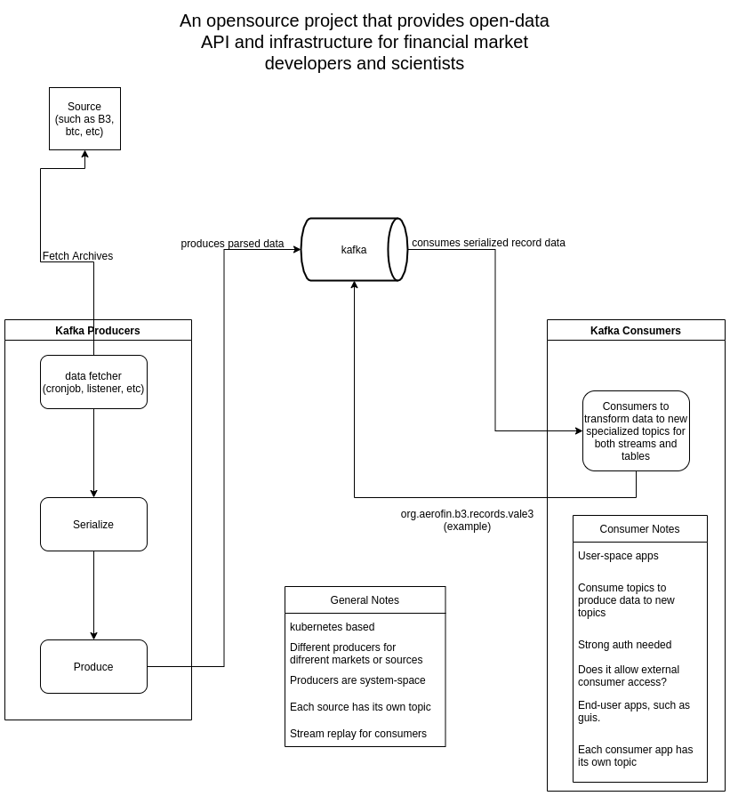

Introduction
============

Aerofin is an early stage open-source project that aims to provide an open-source open-data platform on top of Kafka streams.

The idea is to use Kafka as the data streaming plataform and add several "data sources" as kafka producers to allow
developers to create data consumers/apps with those streams, see the following overly simplistic diagram:

